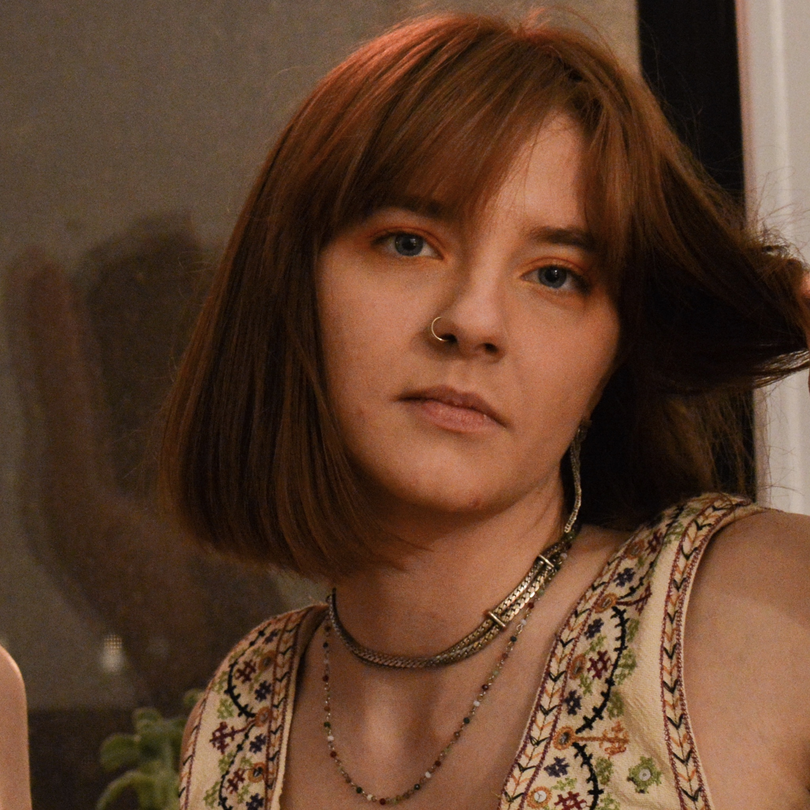

syd botz (sounds like "boats"). 

i am a yarn fiber artist, a software developer, a technology culture critic, and an amateur country/bluegrass music historian based out of a lawn chair
somewhere in Minnesota. i believe in the power of dancing, asking questions, kind company, radical action, and patience to carry us 
through chaotic times. i believe our deepest forms of knowing are not found striving for certainty. i hope to someday 
be a teacher.  

i am not a banjo player (currently).  

sydneylaurabotz@gmail.com &#183; [@sydboats](https://www.instagram.com/sydboatz/) &#183; [syd-botz](https://github.com/syd-botz)

